# 🚀 Slipstream Rust Plus

  

[🇮🇷 **فارسی (Persian)**](README_FA.md) | [🤝 **Contributing**](CONTRIBUTING.md) | [🐛 **Report Bug**](SUPPORT.md)

**The Ultimate Anti-Censorship DNS Tunnel.**  
*Bypass strict firewalls and enjoy high-speed internet using the power of QUIC over DNS.*

---

## ⚡ What is this?
Imagine your internet traffic is a letter. Firewalls read the envelope and throw it away if they don't like the address.  
**Slipstream Rust Plus** puts your letter inside a "DNS Envelope". Firewalls think it's just a normal address lookup (like asking "where is google.com?") and let it pass. Inside that envelope is your high-speed internet connection!

### 📈 Why "Plus"?
We took the original Slipstream and gave it **superpowers**:
- **🚀 50x Faster**: Optimized for blazing fast speeds up to **4Gbps**!
- **🛡️ Unblockable**: Uses **Multi-Resolver** technology to dodge censorship.
- **🧠 Smart**: Automatically adjusts to your network quality (Adaptive MTU).

```mermaid
%%{init: {'theme': 'dark'}}%%
xy-chart-beta
    title "Download Speed Comparison (MB/s)"
    x-axis [dnstt, Slipstream (C), Rust (Auth), Rust Plus]
    y-axis "MB/s" 0..520
    bar [4.01, 9.12, 24.57, 512]
```

---

## 🛠️ Easy Installation (Beginner Friendly)

Follow these simple steps to get started. You don't need to be a coding wizard! 🧙‍♂️

### 1. Install Requirements
Open your **Terminal** (Ctrl+Alt+T) and run this command to install the necessary tools:

```bash
# Ubuntu / Debian
sudo apt update && sudo apt install -y build-essential cmake pkg-config libssl-dev git rustc cargo

# Arch Linux
sudo pacman -S base-devel cmake openssl git rust
```

### 2. Download the Project
Now, let's get the code:

```bash
git clone https://github.com/Fox-Fig/slipstream-rust-plus.git
cd slipstream-rust-plus
git submodule update --init --recursive
```

### 3. Build It!
Turn the code into a working program (this might take a few minutes for the first time):

```bash
cargo build -p slipstream-client -p slipstream-server --release
```

---

## 🚀 How to Run

### Client (Your Computer)
To bypass censorship effectively, we use **multiple DNS servers** (Resolvers). This makes your connection rock solid! 💪

Run this command:

```bash
./target/release/slipstream-client \
  --domain example.com \
  --resolver 1.1.1.1 \
  --resolver 8.8.8.8 \
  --resolver 9.9.9.9 \
  --tcp-listen-port 5201
```

**🔍 What do these mean?**
- `--domain`: The fake domain we use for the tunnel (match this with your server).
- `--resolver`: The DNS servers we talk to. **The more, the better!**
- `--tcp-listen-port`: The port where your high-speed internet will appear locally.

### Server (Remote VPS)
On your server outside the firewall:

```bash
./target/release/slipstream-server \
  --domain example.com \
  --target-address 127.0.0.1:5201 \
  --cert ./cert.pem \
  --key ./key.pem \
  --reset-seed ./reset-seed
```

---

## 📐 How it Works (Visualized)

```mermaid
graph LR
    User[👤 You] -->|1. TCP Traffic| Client[My Computer]
    Client -->|2. Encrypted QUIC in DNS| R1[DNS 1.1.1.1]
    Client -->|2. Encrypted QUIC in DNS| R2[DNS 8.8.8.8]
    Client -->|2. Encrypted QUIC in DNS| R3[DNS 9.9.9.9]
    R1 -->|3. Forward| Server[☁️ Remote VPS]
    R2 -->|3. Forward| Server
    R3 -->|3. Forward| Server
    Server -->|4. Internet| World[🌍 The Internet]
```



---

## ⚖️ License
This project is licensed under the **GNU General Public License v3.0 (GPLv3)**.  
Portions of this software are based on work originally licensed under the **Apache License 2.0**.

> **License Exception for Upstream Contribution:**  
> Although this project is licensed under GPLv3, the author grants the maintainers of the original upstream project (`Mygod/slipstream-rust`) the right to include, distribute, and modify the contributions made in this fork under the terms of the Apache License 2.0.

---
<div align="center">
  <p>Made with ❤️ at <a href="https://t.me/foxfig">FoxFig</a></p>
  <p>Dedicated to all people of Iran 🇮🇷</p>
</div>
