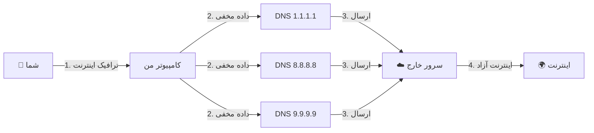

# 🚀 Slipstream Rust Plus

  

[🇺🇸 **English**](README.md) | [🤝 **مشارکت (Contributing)**](CONTRIBUTING.md) | [🐛 **گزارش مشکل**](SUPPORT.md)

**نهایت قدرت در عبور از فیلترینگ DNS**  
*با استفاده از قدرت پروتکل QUIC بر بستر DNS، از سد محکم‌ترین فایروال‌ها عبور کنید.*

---

## ⚡ این چیست؟
فرض کنید اینترنت شما مثل یک نامه است. فایروال‌ها روی پاکت نامه را می‌خوانند و اگر آدرس مقصد را دوست نداشته باشند (مثل یوتیوب یا تلگرام)، نامه را دور می‌اندازند.  
**Slipstream Rust Plus** نامه شما را داخل یک "پاکت DNS" مخفی می‌کند. فایروال‌ها فکر می‌کنند شما فقط دارید آدرس یک سایت معمولی را می‌پرسید (مثلاً "آی‌پی گوگل چند است؟") و نامه را عبور می‌دهند. اما داخل آن پاکت، اینترنت پرسرعت و آزاد شما قرار دارد!

### 📈 چرا نسخه "Plus"؟
ما پروژه اصلی را برداشتیم و به آن **قدرت‌های ویژه** دادیم:
- **🚀 ۵۰ برابر سریع‌تر**: بهینه شده برای سرعت‌های سرسام‌آور تا **4 گیگابیت بر ثانیه**!
- **🛡️ غیرقابل مسدودسازی**: استفاده از تکنولوژی **Multi-Resolver** برای گیج کردن سانسورچی‌ها.
- **🧠 هوشمند**: تنظیم خودکار کیفیت اتصال با توجه به وضعیت اینترنت شما (Adaptive MTU).

```mermaid
%%{init: {'theme': 'dark'}}%%
xy-chart-beta
    title "مقایسه سرعت دانلود (مگابایت بر ثانیه)"
    x-axis [dnstt, Slipstream (C), Rust (Auth), Rust Plus]
    y-axis "MB/s" 0..520
    bar [4.01, 9.12, 24.57, 512]
```

---

## 🛠️ نصب آسان (مخصوص مبتدی‌ها)

نگران نباشید! برای راه‌اندازی این برنامه نیاز نیست برنامه‌نویس باشید. فقط مراحل زیر را انجام دهید. 🧙‍♂️

### ۱. نصب پیشنیازها
ترمینال خود را باز کنید (معمولاً با Ctrl+Alt+T) و این دستور را کپی و اجرا کنید:

```bash
# برای اوبونتو / دبیان
sudo apt update && sudo apt install -y build-essential cmake pkg-config libssl-dev git rustc cargo

# برای آرچ لینوکس
sudo pacman -S base-devel cmake openssl git rust
```

### ۲. دانلود برنامه
حالا کدهای برنامه را دانلود می‌کنیم:

```bash
git clone https://github.com/Fox-Fig/slipstream-rust-plus.git
cd slipstream-rust-plus
git submodule update --init --recursive
```

### ۳. ساختن برنامه (بیلد)
حالا دستور زیر را بزنید تا برنامه ساخته شود (این مرحله ممکن است چند دقیقه‌ای طول بکشد، صبر کنید تا تمام شود):

```bash
cargo build -p slipstream-client -p slipstream-server --release
```

---

## 🚀 نحوه اجرا

### کلاینت (کامپیوتر شما)
برای اینکه فیلترینگ را دور بزنیم، از **چندین سرور DNS** به صورت همزمان استفاده می‌کنیم. این کار باعث می‌شود اتصال شما مثل سنگ محکم باشد! 💪

این دستور را اجرا کنید:

```bash
./target/release/slipstream-client \
  --domain example.com \
  --resolver 1.1.1.1 \
  --resolver 8.8.8.8 \
  --resolver 9.9.9.9 \
  --tcp-listen-port 5201
```

**🔍 این دستورات یعنی چه؟**
- `--domain`: نام دامنه‌ای که برای تونل استفاده می‌کنیم (باید با سرور یکی باشد).
- `--resolver`: سرورهای DNS که ترافیک را از آنها رد می‌کنیم. **هرچه بیشتر باشند، بهتر است!**
- `--tcp-listen-port`: پورتی که اینترنت آزاد روی کامپیوتر شما تحویل داده می‌شود.

### سرور (سرور خارج از کشور)
روی سرور مجازی (VPS) خود این دستور را اجرا کنید:

```bash
./target/release/slipstream-server \
  --domain example.com \
  --target-address 127.0.0.1:5201 \
  --cert ./cert.pem \
  --key ./key.pem \
  --reset-seed ./reset-seed
```

---

## 📐 معماری برنامه (تصویری)



---

## ⚖️ لایسنس
این پروژه تحت لایسنس **GNU General Public License v3.0 (GPLv3)** منتشر شده است.  
بخش‌هایی از نرم‌افزار بر پایه کدی است که تحت لایسنس **Apache License 2.0** بوده است.

> **استثنای لایسنس برای مشارکت در پروژه اصلی:**  
> اگرچه این پروژه تحت لایسنس GPLv3 منتشر شده است، اما نویسنده حق استفاده، توزیع و تغییر کدهای مشارکت‌شده در این فورک را تحت لایسنس Apache 2.0 به صاحبان پروژه اصلی (`Mygod/slipstream-rust`) اهدا می‌کند.

---
<div align="center" dir="rtl">
  <p>ساخته شده با ❤️ در <a href="https://t.me/foxfig">FoxFig</a></p>
  <p>تقدیم به تمام مردم ایران 🇮🇷</p>
</div>
